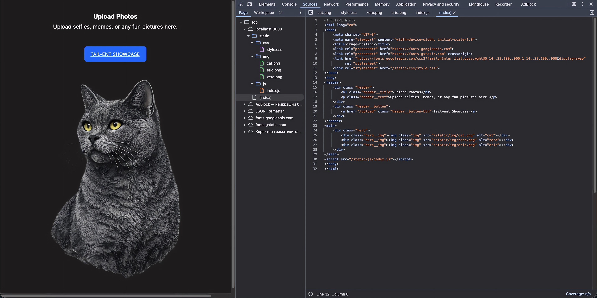
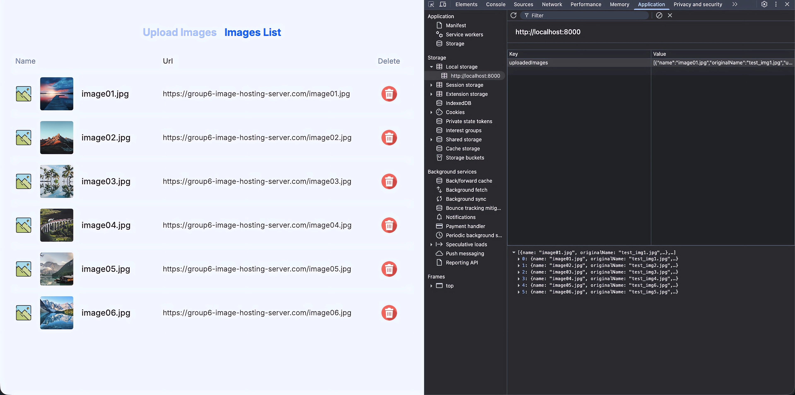

# 🖼️ Image Hosting Server

A web application for uploading, storing, and viewing images.
An educational alternative to services like Imgur and Dropbox, built with pure Python without frameworks.



---

## 🚀 Tech Stack

- **Backend**: Python 3.12 (`http.server`)
- **Database**: PostgreSQL 15
- **Web Server**: Nginx
- **Containerization**: Docker & Docker Compose
- **Frontend**: HTML5, CSS3, JavaScript

---

## ✅ Features

- Image upload (`.jpg`, `.png`, `.gif`, up to **5MB**)
- File format and size validation
- Metadata storage in PostgreSQL
- Image deletion (file + database record)
- Database backup and restore functionality



---

## 📂 Project Structure

```
group6_image_hosting_server/
├── src/
│   ├── app.py           # HTTP server
│   ├── database.py      # PostgreSQL operations
│   ├── validators.py    # File validation
│   ├── file_handler.py  # File saving operations
│   ├── templates/       # HTML pages
│   └── static/          # CSS, JS, images
├── config/
│   ├── nginx.conf       # Nginx configuration
│   └── init.sql         # Database initialization
├── scripts/
│   └── backup.py        # Database backup script
├── images/              # Uploaded images
├── backups/             # Database backups
├── Dockerfile
├── compose.yaml
└── requirements.txt
```

---

## ⚡ Quick Start

### Docker Compose (Recommended)

```bash
git clone git@github.com:YOUR_USERNAME/group6_image_hosting_server.git
cd group6_image_hosting_server
docker compose up --build
```

Open http://localhost:8080

### Local Development (Without Docker)

```bash
python -m venv venv
source venv/bin/activate       # Mac/Linux
venv\Scripts\activate          # Windows

pip install -r requirements.txt
python src/app.py
```

Open http://localhost:8000

---

## 🌐 Application Pages

| URL | Description |
|-----|-------------|
| `/` | Home page |
| `/upload` | Image upload page |
| `/images-list` | Image gallery |
| `/api/images` | API - image list (JSON) |

---

## 🗄️ Database Backup

```bash
# Create backup
python scripts/backup.py create

# List backups
python scripts/backup.py list

# Restore from backup
python scripts/backup.py restore backup_2024-01-01_120000.sql
```

---

## 🛠️ Requirements

- Python 3.12+
- Docker & Docker Compose
- PostgreSQL 15 (or via Docker)

---

## 🔧 Environment Variables

Create `.env` file in project root:

```env
DB_HOST=localhost
DB_NAME=group6_image_hosting_server_db
DB_USER=postgres
DB_PASSWORD=your_password
DB_PORT=5432
BACKUP_DIR=./backups
DB_CONTAINER_NAME=group6_image_hosting_server-db-1
```

---

## 👥 Authors

- Group 6 - Educational project
